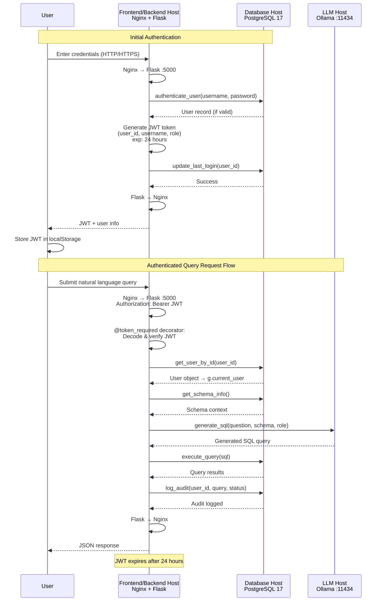
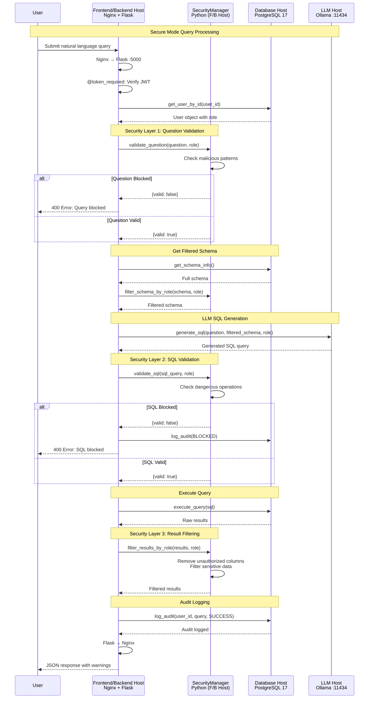
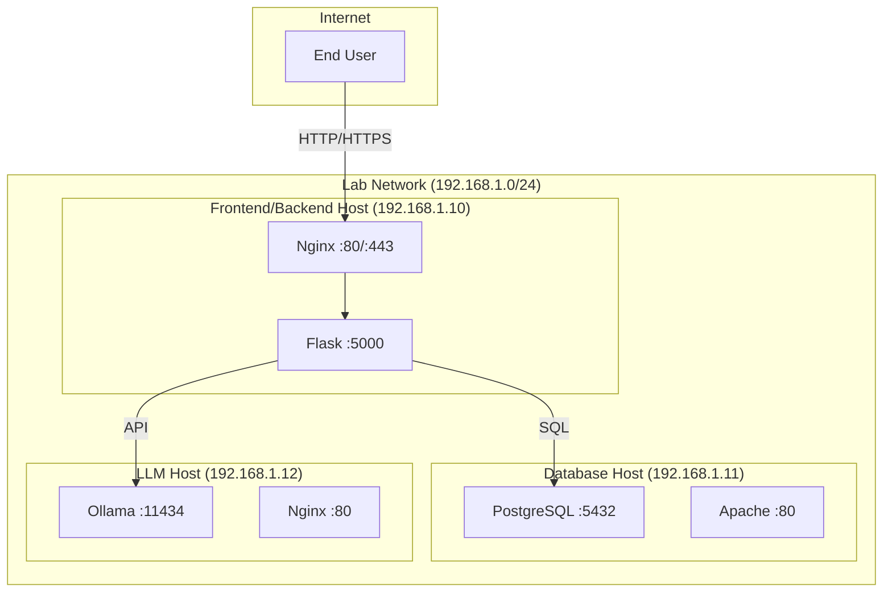

<div align="center">
  
</div>

!!! warning "**DRAFT** - This documentation is a work in progress"

# Architecture Diagrams

This page contains all architecture diagrams for the Healthcare Database Security Testing Lab.

---

## System Architecture

The following diagram shows the complete system architecture with all three hosts and their communication paths.
```
┌─────────────────┐
│   Frontend      │  Port: 5173
│   (Vite)        │
└────────┬────────┘
         │
         │ HTTP/HTTPS
         │
┌────────▼────────┐
│   Backend API   │  Port: 5000
│   (Flask)       │  Host: BACKEND_HOST
└────┬──────┬─────┘
     │      │
     │      └──────────┐
     │                 │
┌────▼────────┐  ┌────▼────────┐
│  PostgreSQL │  │   Ollama    │
│  Database   │  │   LLM       │
│             │  │             │
│ Port: 5432  │  │ Port: 11434 │
│ DB_HOST     │  │ LLM_HOST    │
└─────────────┘  └─────────────┘
```

---

## Authentication Flow

This diagram illustrates the complete authentication and query processing flow.



[View Full Mermaid Source](../reference/auth-flow-diagram.mermaid)

---

## Secure Mode Flow

This diagram shows the security validation layers in secure mode.



[View Full Mermaid Source](../security/secure-mode-flow.mermaid)

---

## Network Topology



---

## Database Entity-Relationship Diagram

See the [Database ERD page](../database/erd.md) for the complete healthcare database schema diagram.

---

## Related Documentation

- [System Overview](overview.md)
- [Authentication Flow](authentication.md)
- [Security Layers](security-layers.md)
- [System Specifications](specifications.md)

---

*Last Updated: [Date]*  
*Lab Version: 1.0*
