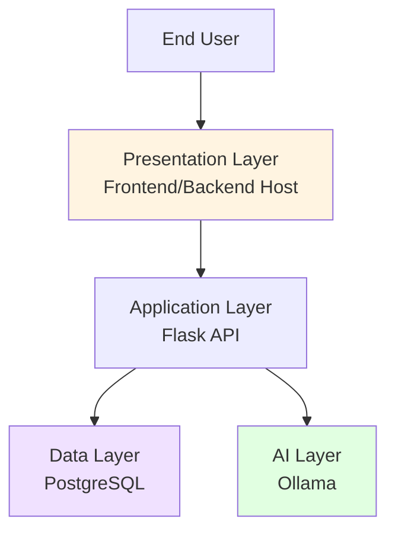

  

# Architecture Overview

## System Architecture

The Healthcare Database Security Research Lab implements a distributed three-tier architecture designed to demonstrate SQL injection vulnerabilities and security control effectiveness.

## High-Level Architecture

## Components

### Presentation Layer
**Host:** Frontend/Backend (192.168.1.10)
- Nginx web server serving Vite frontend
- User interface for query submission
- Results display and visualization
- Session management

### Application Layer  
**Host:** Frontend/Backend (192.168.1.10)
- Flask REST API
- JWT authentication
- Security control implementation
- Request/response handling
- Audit logging

### Data Layer
**Host:** Database (192.168.1.11)
- PostgreSQL 17 database
- Healthcare schema
- User credentials
- Audit logs

### AI Layer
**Host:** LLM (192.168.1.12)
- Ollama inference engine
- deepseek-coder:1.3b model
- Natural language to SQL conversion

## Design Decisions

### Why Three Hosts?

1. **Separation of Concerns:** Isolates each layer for testing
2. **Security Testing:** Enables network-level vulnerability testing
3. **Realistic Architecture:** Mimics real-world deployments
4. **Performance:** LLM on physical machine for optimal inference

### Why Vulnerable + Secure Modes?

Allows direct comparison of:
- Attack success rates
- Security control effectiveness
- Performance impact
- User experience

## Related Documentation

- [Detailed Diagrams](diagrams.md)
- [Authentication Flow](authentication.md)
- [Security Layers](security-layers.md)
- [System Specifications](specifications.md)

---

*Last Updated: January 6, 2026*
*Documentation Version: 1.1*
*Lab Version: 1.0*
