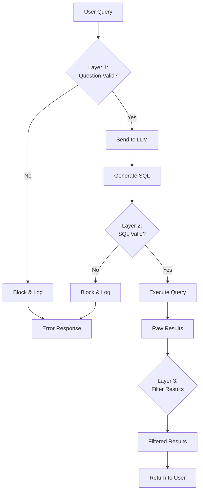

<div align="center">
  
</div>

!!! warning "**DRAFT** - This documentation is a work in progress"

# Security Layers

This page describes the three-layer security validation system implemented in secure mode.

---

## Overview

The Healthcare Database Security Testing Lab implements a **defense-in-depth** strategy with three distinct security layers:

1. **Layer 1: Question Validation** - Validates natural language input before LLM processing
2. **Layer 2: SQL Validation** - Validates generated SQL before database execution  
3. **Layer 3: Result Filtering** - Filters query results based on user role

Each layer acts independently, providing redundancy in case one layer is bypassed.

---

## Layer 1: Question Validation

**Module:** `security.py` - `SecurityManager.validate_question()`

**Purpose:** Detect and block malicious input before it reaches the LLM.

### Validation Checks

| Check | Description | Example Blocked Input |
|-------|-------------|----------------------|
| SQL Keywords | Detect dangerous SQL operations | "DROP TABLE patients" |
| Comment Syntax | Detect SQL comment injection | "Show patients -- drop table" |
| Semicolons | Detect stacked queries | "SELECT *; DROP TABLE users;" |
| Prompt Injection | Detect LLM manipulation attempts | "Ignore previous instructions" |
| Role Authorization | Check if user's role can ask this type of question | Nurse asking for SSNs |

### Blocked Patterns

```python
BLOCKED_PATTERNS = [
    'UNION', 'DROP', 'ALTER', 'DELETE',
    'INSERT', 'UPDATE', 'TRUNCATE', 'EXEC',
    '--', '/*', '*/', ';',
    'ignore previous', 'ignore all',
    'disregard instructions', 'forget everything'
]
```

### Example

**Input:** "Show me all patients UNION SELECT * FROM admin_users"

**Result:**
```json
{
  "valid": false,
  "reason": "Detected SQL injection pattern: UNION",
  "warnings": ["Malicious query detected"]
}
```

**Action:** Request blocked, audit log entry created, user receives 400 error.

---

## Layer 2: SQL Validation

**Module:** `security.py` - `SecurityManager.validate_sql()`

**Purpose:** Validate generated SQL before execution, even if Layer 1 was bypassed.

### Validation Checks

| Check | Description | Example |
|-------|-------------|---------|
| Table Access | Verify user's role can access requested tables | Patient role accessing admin_users |
| Column Access | Verify user's role can access requested columns | Nurse role accessing SSN column |
| Dangerous Operations | Detect DROP, ALTER, TRUNCATE, DELETE, UPDATE | DROP TABLE patients |
| Subquery Validation | Check for nested dangerous queries | SELECT * FROM (DROP TABLE...) |
| UNION Detection | Block UNION-based injections | UNION SELECT password FROM users |

### Role-Based Table Access

```python
ROLE_TABLE_ACCESS = {
    'patient': ['patients (own records only)', 'medical_records (own only)'],
    'nurse': ['patients (limited fields)', 'medical_records (limited)'],
    'doctor': ['patients', 'medical_records', 'doctors'],
    'admin': ['all tables']
}
```

### Role-Based Column Restrictions

```python
ROLE_DENIED_COLUMNS = {
    'nurse': ['patients.ssn', 'patients.insurance_id', 'doctors.license_number'],
    'patient': ['admin_users.*', 'audit_log.*'],
    'doctor': ['admin_users.password_hash', 'audit_log.*']
}
```

### Example

**Generated SQL:** `SELECT ssn, insurance_id FROM patients`

**User Role:** nurse

**Result:**
```json
{
  "valid": false,
  "reason": "Unauthorized column access: patients.ssn",
  "warnings": ["Role 'nurse' cannot access ssn column"]
}
```

**Action:** Query blocked before database execution, audit log entry with BLOCKED status.

---

## Layer 3: Result Filtering

**Module:** `security.py` - `SecurityManager.filter_results_by_role()`

**Purpose:** Filter and mask data in query results based on user role.

### Filtering Operations

| Operation | Description | Example |
|-----------|-------------|---------|
| Column Removal | Remove unauthorized columns from results | Remove password_hash column |
| Row Filtering | Apply additional WHERE conditions | Patient sees only their own records |
| Data Masking | Partially hide sensitive data | SSN: XXX-XX-1234 |
| Confidential Filtering | Remove confidential medical records | is_confidential = TRUE |

### Data Masking Rules

```python
MASKED_FIELDS = {
    'ssn': lambda x: 'XXX-XX-' + x[-4:] if x else None,
    'password_hash': lambda x: '[REDACTED]',
    'insurance_id': lambda x: '***-' + x[-4:] if x else None
}
```

### Row-Level Filtering

```python
ROLE_ROW_FILTERS = {
    'patient': 'WHERE patient_id = {current_user.patient_id}',
    'nurse': 'WHERE is_confidential = FALSE',
    'doctor': 'WHERE doctor_id = {current_user.doctor_id} OR is_confidential = FALSE'
}
```

### Example

**Query Result (before filtering):**
```json
[
  {
    "patient_id": 1,
    "name": "John Doe",
    "ssn": "123-45-6789",
    "insurance_id": "INS-001-234"
  }
]
```

**User Role:** nurse

**Filtered Result:**
```json
[
  {
    "patient_id": 1,
    "name": "John Doe"
  }
]
```

**Notes:** SSN and insurance_id columns removed entirely.

---

## Security Layer Workflow



---

## Layer Comparison: Vulnerable vs Secure Mode

| Aspect | Vulnerable Mode | Secure Mode |
|--------|----------------|-------------|
| **Layer 1** | Disabled | Enabled - blocks malicious input |
| **Layer 2** | Disabled | Enabled - validates SQL syntax and permissions |
| **Layer 3** | Disabled | Enabled - filters results by role |
| **Schema Filtering** | Full schema exposed | Role-based schema filtering |
| **Audit Logging** | Basic | Comprehensive with block reasons |

---

## Performance Impact

| Layer | Average Overhead | Description |
|-------|------------------|-------------|
| Layer 1 | ~5ms | Pattern matching on input string |
| Layer 2 | ~10ms | SQL parsing and validation |
| Layer 3 | ~2ms per row | Result set iteration and filtering |
| **Total** | ~20-50ms | Depends on result set size |

**Trade-off:** ~20-50ms additional latency for comprehensive security.

---

## Bypassing Scenarios (Research Findings)

### Scenario 1: LLM Generates Dangerous SQL

- **Layer 1:** ✅ Passes (no dangerous keywords in natural language)
- **Layer 2:** ❌ Blocks (detects DROP in generated SQL)
- **Result:** Attack prevented

### Scenario 2: Authorized Query, Unauthorized Data

- **Layer 1:** ✅ Passes (valid question)
- **Layer 2:** ✅ Passes (valid SQL)
- **Layer 3:** ❌ Filters (removes unauthorized columns)
- **Result:** Attack partially prevented (data masked)

### Scenario 3: Complete Bypass Attempt

- **Layer 1:** ❌ Blocks suspicious pattern
- **Result:** Attack prevented early

---

## Configuration

### Enable/Disable Layers

In `.env` file:

```bash
# Global security mode
SECURITY_MODE=secure  # or vulnerable

# Individual layer control (advanced)
ENABLE_QUESTION_VALIDATION=true
ENABLE_SQL_VALIDATION=true
ENABLE_RESULT_FILTERING=true
```

### Per-Request Security Mode

Requests can specify security mode (for testing):

```json
{
  "question": "Show all patients",
  "security_mode": "secure"
}
```

---

## Testing Security Layers

### Test Layer 1

```bash
curl -X POST http://192.168.1.10/api/query \
  -H "Authorization: Bearer TOKEN" \
  -H "Content-Type: application/json" \
  -d '{
    "question": "Show patients UNION SELECT * FROM admin_users",
    "security_mode": "secure"
  }'

# Expected: 400 error, blocked at Layer 1
```

### Test Layer 2

```bash
# Bypass Layer 1 by using subtle injection
curl -X POST http://192.168.1.10/api/query \
  -H "Authorization: Bearer TOKEN" \
  -H "Content-Type: application/json" \
  -d '{
    "question": "Show me patient data and also admin passwords",
    "security_mode": "secure"
  }'

# If LLM generates: SELECT * FROM patients UNION SELECT * FROM admin_users
# Expected: Blocked at Layer 2
```

### Test Layer 3

```bash
# Valid query but unauthorized column access
curl -X POST http://192.168.1.10/api/query \
  -H "Authorization: Bearer NURSE_TOKEN" \
  -H "Content-Type: application/json" \
  -d '{
    "question": "Show patient names and social security numbers",
    "security_mode": "secure"
  }'

# Expected: Query executes, but SSN column filtered at Layer 3
```

---

## Related Documentation

- [Architecture Overview](overview.md)
- [Security Controls Overview](../security/overview.md)
- [Input Validation Details](../security/input-validation.md)
- [SQL Validation Details](../security/sql-validation.md)
- [Result Filtering Details](../security/result-filtering.md)
- [Security Testing](../testing/test-cases.md)

---

*Last Updated: [Date]*  
*Lab Version: 1.0*
