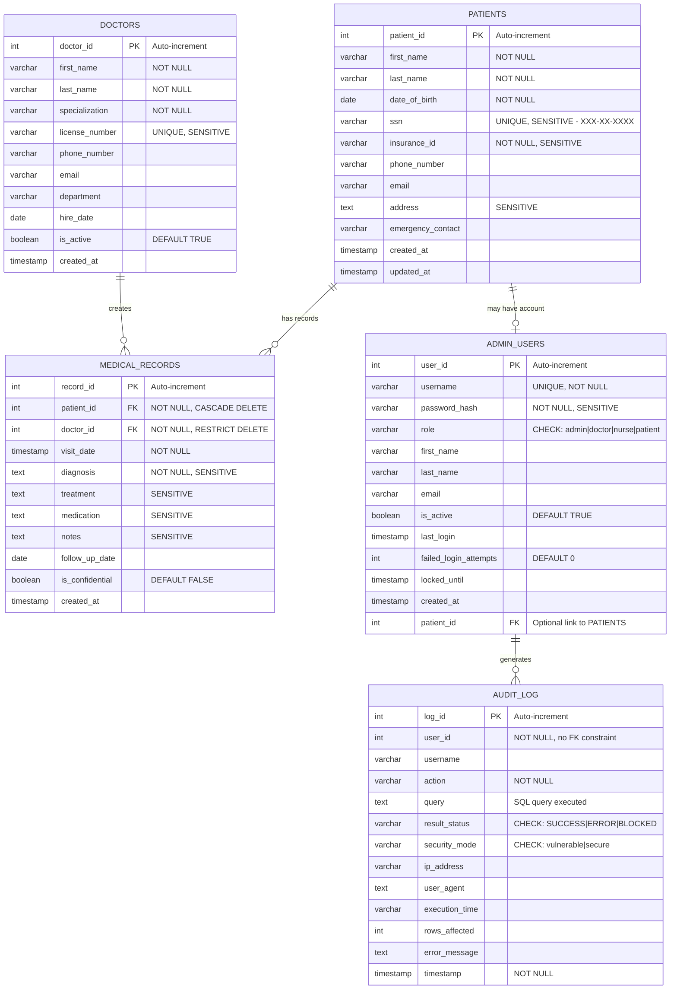
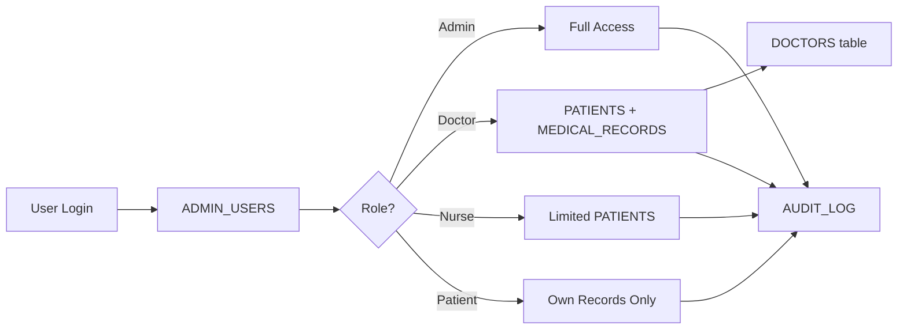

<div align="center">
  
</div>

# Entity-Relationship Diagram

Complete ERD for the Healthcare Database Security Testing Lab database schema.

---

## Database ERD



[Download Mermaid Source](healthcare-erd.mermaid)

---

## Relationships Explained

### PATIENTS ↔ MEDICAL_RECORDS (One-to-Many)

- One patient can have many medical records
- Each medical record belongs to exactly one patient
- Cascade delete: If patient is deleted, all their medical records are deleted
- Foreign key: `medical_records.patient_id` → `patients.patient_id`

### DOCTORS ↔ MEDICAL_RECORDS (One-to-Many)

- One doctor can create many medical records
- Each medical record is created by exactly one doctor
- Restrict delete: Cannot delete doctor if they have associated medical records
- Foreign key: `medical_records.doctor_id` → `doctors.doctor_id`

### PATIENTS ↔ ADMIN_USERS (One-to-Zero-or-One)

- A patient may optionally have one admin user account (for patient portal access)
- Admin users with doctor, nurse, or admin roles do not have patient_id
- Optional relationship: `admin_users.patient_id` → `patients.patient_id`

### ADMIN_USERS ↔ AUDIT_LOG (One-to-Many)

- One user generates many audit log entries
- Each audit log entry is associated with one user
- No foreign key constraint (intentional to prevent cascade issues)
- Logical relationship only: `audit_log.user_id` references `admin_users.user_id`

---

## Entity Descriptions

### PATIENTS

**Purpose:** Store patient demographic and contact information

**Key Characteristics:**
- Primary table for PHI (Protected Health Information)
- Contains highly sensitive fields (SSN, insurance_id)
- Central entity in the schema

**Security Focus:**
- SSN field is primary target for SQL injection attacks
- All fields except patient_id are considered PHI

### DOCTORS

**Purpose:** Store healthcare provider information

**Key Characteristics:**
- Professional credentials (license numbers)
- Department assignments
- Active status tracking

**Security Focus:**
- License numbers are sensitive
- Links to medical records for authorization

### MEDICAL_RECORDS

**Purpose:** Store clinical encounter data

**Key Characteristics:**
- Links patients to doctors
- Contains diagnosis, treatment, medication
- Confidential flag for extra-sensitive cases

**Security Focus:**
- Most sensitive clinical data
- Primary target for unauthorized data extraction
- Role-based access critical

### ADMIN_USERS

**Purpose:** Authentication and authorization

**Key Characteristics:**
- Four role types: admin, doctor, nurse, patient
- Password hashing with bcrypt
- Failed login tracking for security

**Security Focus:**
- Password hashes are CRITICAL
- Role field determines all access permissions
- Target for privilege escalation attempts

### AUDIT_LOG

**Purpose:** Security audit trail

**Key Characteristics:**
- Logs all database queries
- Tracks security mode (vulnerable/secure)
- Records block attempts

**Security Focus:**
- Essential for research analysis
- Tracks attack patterns
- No foreign key to prevent deletion

---

## Cardinality Summary

```
Patients (1) ────< Medical Records (Many) >──── (1) Doctors
    │
    │ (0 or 1)
    ↓
Admin Users (1) ────< Audit Log (Many)
```

---

## Sensitive Data Distribution

| Table | Highly Sensitive Fields | Sensitive Fields | PHI Fields |
|-------|------------------------|------------------|------------|
| PATIENTS | ssn | insurance_id, address | All fields except patient_id |
| DOCTORS | license_number | - | - |
| MEDICAL_RECORDS | diagnosis, treatment, medication, notes | visit_date, follow_up_date | All clinical fields |
| ADMIN_USERS | password_hash | patient_id | - |
| AUDIT_LOG | query (may contain sensitive data) | - | - |

---

## Index Strategy

### Primary Keys
- All tables have auto-incrementing integer primary keys
- Ensures efficient joins and lookups

### Unique Indexes
- `patients.ssn` - Prevent duplicate social security numbers
- `doctors.license_number` - Prevent duplicate medical licenses
- `admin_users.username` - Prevent duplicate usernames

### Performance Indexes
- Name searches: `patients(last_name, first_name)`
- Doctor specialization: `doctors(specialization)`
- Medical record lookups: `medical_records(patient_id)`, `medical_records(doctor_id)`
- Audit queries: `audit_log(user_id)`, `audit_log(timestamp)`, `audit_log(action)`

---

## Data Flow Diagram



---

## Related Documentation

- [Database Schema Details](schema.md) - Complete table documentation
- [Data Classification](data-classification.md) - Security classifications

---

*Last Updated: [Date]*  
*Lab Version: 1.0*
