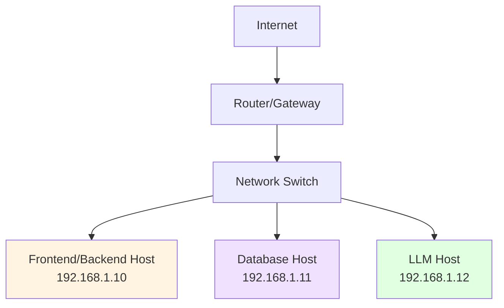

<div align="center">
  
</div>

# Network Configuration

Configuration guide for the network infrastructure connecting the three hosts in the Healthcare Database Security Testing Lab.

!!! note "Example IP Addresses"
    The IP addresses shown in this guide (192.168.1.x) are **examples only**. You should:

    - Use your actual network configuration for manual deployment
    - Let Docker handle networking automatically (recommended - see [Docker Deployment](../DOCKER_QUICKSTART.md))
    - Adjust these examples to match your network infrastructure

## Network Topology



## IP Address Plan

| Host | IP Address | Subnet Mask | Gateway | DNS |
|------|-----------|-------------|---------|-----|
| Frontend/Backend | 192.168.1.10 | 255.255.255.0 | 192.168.1.1 | 192.168.1.1 |
| Database | 192.168.1.11 | 255.255.255.0 | 192.168.1.1 | 192.168.1.1 |
| LLM | 192.168.1.12 | 255.255.255.0 | 192.168.1.1 | 192.168.1.1 |

## Static IP Configuration

### Ubuntu Netplan Configuration

For Ubuntu systems using Netplan (Ubuntu 18.04+):

Create or edit `/etc/netplan/01-netcfg.yaml`:

=== "Frontend/Backend (192.168.1.10)"

    ```yaml
    network:
      version: 2
      renderer: networkd
      ethernets:
        ens33:  # Your interface name may vary
          dhcp4: no
          addresses:
            - 192.168.1.10/24
          gateway4: 192.168.1.1
          nameservers:
            addresses:
              - 192.168.1.1
              - 8.8.8.8
    ```

=== "Database (192.168.1.11)"

    ```yaml
    network:
      version: 2
      renderer: networkd
      ethernets:
        ens33:
          dhcp4: no
          addresses:
            - 192.168.1.11/24
          gateway4: 192.168.1.1
          nameservers:
            addresses:
              - 192.168.1.1
              - 8.8.8.8
    ```

=== "LLM (192.168.1.12)"

    ```yaml
    network:
      version: 2
      renderer: networkd
      ethernets:
        ens33:
          dhcp4: no
          addresses:
            - 192.168.1.12/24
          gateway4: 192.168.1.1
          nameservers:
            addresses:
              - 192.168.1.1
              - 8.8.8.8
    ```

Apply the configuration:

```bash
sudo netplan apply
```

Verify:

```bash
ip addr show
ip route show
```

## Port Configuration

### Open Ports by Host

**Frontend/Backend Host (192.168.1.10):**

| Port | Service | Access |
|------|---------|--------|
| 80 | HTTP (Nginx) | Public |
| 443 | HTTPS (Nginx) | Public (secure mode) |
| 5000 | Flask API | Internal only |
| 22 | SSH | Admin only |

**Database Host (192.168.1.11):**

| Port | Service | Access |
|------|---------|--------|
| 5432 | PostgreSQL | From 192.168.1.10 only |
| 80 | Apache | Optional |
| 22 | SSH | Admin only |

**LLM Host (192.168.1.12):**

| Port | Service | Access |
|------|---------|--------|
| 11434 | Ollama | From 192.168.1.10 only |
| 80 | Nginx | Optional |
| 22 | SSH | Admin only |

## Connectivity Testing

### Test from Frontend/Backend to Database

```bash
# Ping test
ping -c 4 192.168.1.11

# PostgreSQL connection test
psql -h 192.168.1.11 -U healthcare_user -d healthcare_research -c "SELECT 1;"

# Port connectivity test
nc -zv 192.168.1.11 5432
```

### Test from Frontend/Backend to LLM

```bash
# Ping test
ping -c 4 192.168.1.12

# Ollama API test
curl http://192.168.1.12:11434/api/tags

# Port connectivity test
nc -zv 192.168.1.12 11434
```

### Full Stack Test

```bash
# From Frontend/Backend host, test complete request flow
curl -X POST http://localhost/api/login \
  -H "Content-Type: application/json" \
  -d '{"username": "admin", "password": "password123"}'
```

## Firewall Rules

### Vulnerable Mode Rules

Allow all traffic for testing:

```bash
# On all hosts
sudo ufw allow from 192.168.1.0/24
sudo ufw allow ssh
sudo ufw enable
```

### Secure Mode Rules

Restrict to specific sources:

**Frontend/Backend Host:**
```bash
sudo ufw reset
sudo ufw default deny incoming
sudo ufw default allow outgoing
sudo ufw allow ssh
sudo ufw allow 80/tcp
sudo ufw allow 443/tcp
sudo ufw enable
```

**Database Host:**
```bash
sudo ufw reset
sudo ufw default deny incoming
sudo ufw default allow outgoing
sudo ufw allow ssh
sudo ufw allow from 192.168.1.10 to any port 5432 proto tcp
sudo ufw enable
```

**LLM Host:**
```bash
sudo ufw reset
sudo ufw default deny incoming
sudo ufw default allow outgoing
sudo ufw allow ssh
sudo ufw allow from 192.168.1.10 to any port 11434 proto tcp
sudo ufw enable
```

## DNS Configuration

For local development, add entries to `/etc/hosts` on each machine:

```bash
# Add to /etc/hosts on all hosts
192.168.1.10    frontend-backend-01 frontend backend
192.168.1.11    database-01 db
192.168.1.12    llm-01 llm
```

This allows you to use hostnames instead of IP addresses.

## Network Performance Testing

### Bandwidth Test

Install iperf3 and test bandwidth between hosts:

```bash
# On Database host (server)
sudo apt install -y iperf3
iperf3 -s

# On Frontend/Backend host (client)
iperf3 -c 192.168.1.11
```

### Latency Test

```bash
# Ping test with statistics
ping -c 100 192.168.1.11 | tail -1
```

Expected latency: <1ms for local network

## Troubleshooting

### Cannot Ping Other Hosts

```bash
# Check IP configuration
ip addr show

# Check routing table
ip route show

# Check if interface is up
sudo ip link set ens33 up

# Restart networking
sudo systemctl restart systemd-networkd
```

### Cannot Connect to Services

```bash
# Check if service is listening
sudo netstat -tulpn | grep <port>

# Check firewall rules
sudo ufw status

# Check if host firewall is blocking
sudo iptables -L -n

# Disable firewall temporarily for testing
sudo ufw disable
```

### DNS Not Resolving

```bash
# Check DNS configuration
cat /etc/resolv.conf

# Test DNS resolution
nslookup google.com

# Try alternative DNS
echo "nameserver 8.8.8.8" | sudo tee /etc/resolv.conf
```

## Related Documentation

- [Frontend/Backend Host Setup](frontend-backend.md)
- [Database Host Setup](database-host.md)
- [LLM Host Setup](llm-host.md)
- [Security Testing with Port Scans](../testing/test-cases.md)

---

*Last Updated: [November 1,2025]*  
*Lab Version: 1.0*
