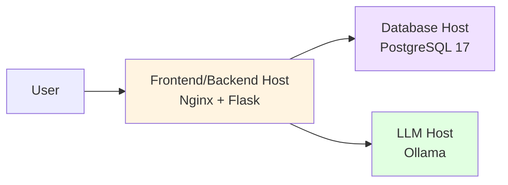

  

# Healthcare Database Security Research Lab

!!! info This documentation covers the complete setup and testing methodology for a distributed healthcare database security research environment. The lab is designed to test SQL injection vulnerabilities and security controls in natural language to SQL systems.

---

## Purpose

This test lab was developed for academic research (MET CS 674) into database security vulnerabilities, specifically examining:

- SQL injection attack vectors in healthcare systems
- Natural language to SQL conversion security risks
- Role-based access control effectiveness
- Network-level security vulnerabilities
- Defense-in-depth security strategies

---

## System Architecture

The research lab consists of three distributed hosts:

| Host | IP Address | OS | Primary Services |
|------|-----------|-----|------------------|
| Frontend/Backend | 192.168.1.10 | Ubuntu 24.04 | Nginx 1.26, Flask 3.1.2, Vite (Vanilla JS) |
| Database | 192.168.1.11 | Ubuntu 25.04 | PostgreSQL 17, Apache 2 |
| LLM | 192.168.1.12 | Ubuntu 24.04 | Ollama 0.12.3, deepseek-coder:1.3b |

---

## Deployment Options

!!! tip "Choose Your Deployment Method"
    The application can be deployed in multiple ways. Choose based on your experience level:

    - 🐳 **[Docker Deployment](DOCKER_QUICKSTART.md)** - Easiest! Single command setup (10-15 minutes)
    - 🔧 **[Automated Scripts](QUICKSTART.md)** - Interactive installation wizard (20-30 minutes)
    - 📖 **[Manual Setup](#quick-start)** - Full control, detailed below (45-60 minutes)
    - 🚀 **[Deployment Guide](START_HERE.md)** - Compare all options and choose

---

## Quick Start

### Prerequisites

- VMware Workstation 17.6.2 (or compatible hypervisor) *[for manual setup]*
- Physical machine for LLM host (recommended) *[for manual setup]*
- Basic networking knowledge
- Understanding of database security concepts

!!! info "Using Docker?"
    If using Docker deployment, you can skip the manual VM setup below. See [Docker Quick Start](DOCKER_QUICKSTART.md) instead.

### Setup Steps

1. **[Set up the Frontend/Backend Host](hosts/frontend-backend.md)**
   - Install Ubuntu 24.04
   - Configure Nginx and Flask
   - Deploy Vite frontend

2. **[Set up the Database Host](hosts/database-host.md)**
   - Install Ubuntu 25.04
   - Configure PostgreSQL 17
   - Load healthcare schema

3. **[Set up the LLM Host](hosts/llm-host.md)**
   - Install Ollama
   - Pull deepseek-coder model
   - Configure network access

4. **[Configure Network Security](hosts/network-config.md)**
   - Set static IPs
   - Configure firewalls
   - Test connectivity

5. **[Run Security Tests](testing/methodology.md)**
   - Execute vulnerable mode tests
   - Implement security controls
   - Re-run tests in secure mode

---

## Key Features

### Dual Operating Modes

!!! info "Vulnerable Mode"
    Minimal security controls to demonstrate attack vectors:
    
    - No input validation
    - Direct SQL execution
    - Unfiltered results
    - HTTP (no encryption)
    - Open firewall rules

!!! success "Secure Mode"
    Comprehensive security controls:
    
    - Three-layer validation (question, SQL, results)
    - Role-based access control
    - Data masking and filtering
    - HTTPS/TLS encryption
    - Restricted firewall rules

### Security Testing

The lab includes 16 comprehensive test cases covering:

- SQL injection attacks (UNION, comment injection, stacked queries)
- Authorization bypass attempts
- Privilege escalation
- LLM prompt injection
- Data leakage
- Network security (port scanning, packet sniffing)

[View Full Test Documentation →](testing/test-cases.md)

---

## Documentation Structure

### 📋 For Lab Setup

- **[Host Setup](hosts/frontend-backend.md)** - Step-by-step installation guides
- **[Configuration Files](config/nginx.md)** - All config files with explanations
- **[Troubleshooting](troubleshooting/common-issues.md)** - Common problems and solutions

### 🏗️ For Architecture Understanding

- **[Architecture Overview](architecture/overview.md)** - System design and component interaction
- **[Database Schema](database/schema.md)** - Complete table documentation
- **[Security Layers](architecture/security-layers.md)** - Defense-in-depth explanation

### 🧪 For Research/Testing

- **[Testing Methodology](testing/methodology.md)** - Research approach and process
- **[Test Cases](testing/test-cases.md)** - All 16 test scenarios with templates
- **[Results Analysis](testing/results.md)** - Metrics and comparison frameworks

### 🔒 For Security Controls

- **[Security Overview](security/overview.md)** - All implemented controls
- **[Input Validation](security/input-validation.md)** - Layer 1 security
- **[SQL Validation](security/sql-validation.md)** - Layer 2 security
- **[Result Filtering](security/result-filtering.md)** - Layer 3 security

---

## Research Objectives

This lab supports research into:

1. **Vulnerability Assessment**
   - Identify common SQL injection vectors in NL2SQL systems
   - Measure exploitability of healthcare database systems
   - Analyze LLM prompt injection effectiveness

2. **Security Control Effectiveness**
   - Compare security approaches (input validation, parameterized queries, result filtering)
   - Measure performance impact of security controls
   - Evaluate false positive/negative rates

3. **Real-World Applicability**
   - Test controls with realistic healthcare data structure
   - Assess usability impact of security measures
   - Develop best practices for secure NL2SQL implementations

[View Full Research Methodology →](research/methodology.md)

---

## Technology Stack

### Backend
- **Flask 3.1.2** - REST API framework
- **Python 3.12** - Application runtime
- **PyJWT** - JWT token authentication
- **Loguru** - Logging and audit trails

### Database
- **PostgreSQL 17** - Primary data store
- **Healthcare Schema** - Patients, doctors, medical records, audit logs

### LLM
- **Ollama 0.13.5** - LLM inference engine
- **deepseek-coder:1.3b** - Code-focused language model
- **Natural Language to SQL** - Query generation

### Frontend
- **Vite (Vanilla JavaScript)** - User interface
- **Nginx 1.26** - Web server and reverse proxy

### Infrastructure
- **Ubuntu 24.04/25.04** - Operating systems
- **VMware Workstation 17.6.2** - Virtualization
- **SSL/TLS** - Transport encryption

---

## Getting Help

!!! question "Need Assistance?"
    
    **Setup Issues:** Check the [Troubleshooting Guide](troubleshooting/common-issues.md)
    
    **Configuration Questions:** See [Configuration Files](config/nginx.md) section
    
    **Research Questions:** Review [Research Methodology](research/methodology.md)
    
    **Security Concerns:** This is a research lab only - never use with real patient data

---

## Contributing

This is an academic research project. For questions or collaboration:

- **Email:** sarahsl@bu.edu
- **GitHub:** [Project Repository](https://github.com/sarahsl-prog)
- **Course:** MET CS 674 - Database Security

---

## License & Disclaimer

!!! warning "Research Use Only"
    This lab contains intentional security vulnerabilities for research purposes. 
    
    - **Never deploy to production**
    - **Use only synthetic test data**
    - **Isolated network environment only**
    - **No real PHI/PII should be used**

This project is for educational purposes as part of MET CS 674 coursework.

---

## Acknowledgments

- **Course:** MET CS 674 - Database Security
- **Institution:** Boston University Metropolitan College
- **Tools:** Material for MkDocs, PostgreSQL, Ollama, Flask

---

*Last Updated: [Date]*  
*Documentation Version: 1.0*  
*Lab Version: 1.0*